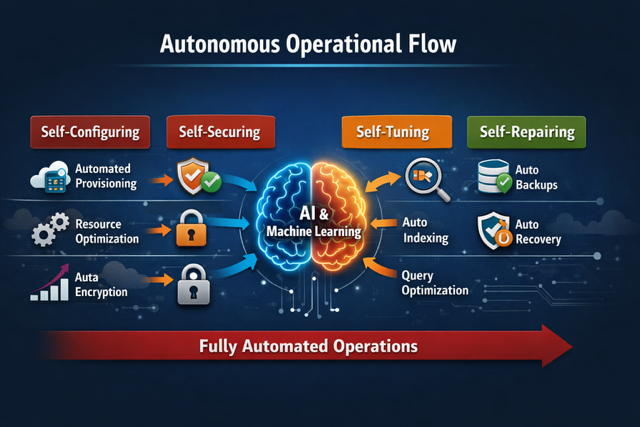
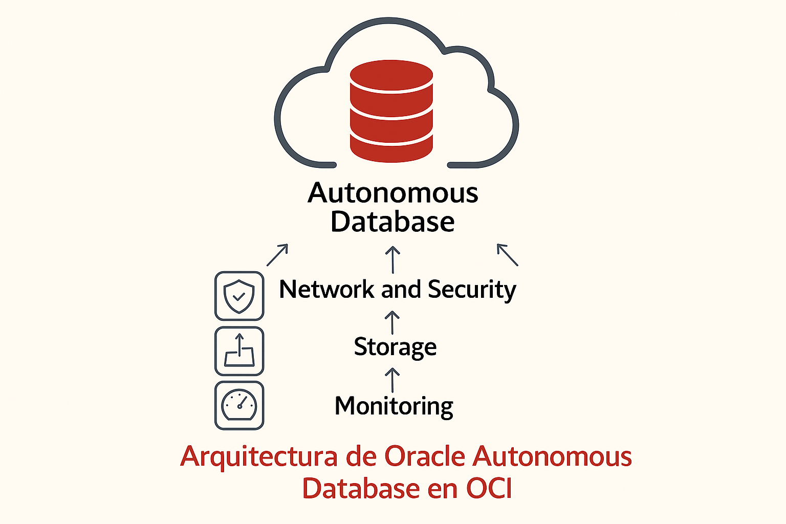
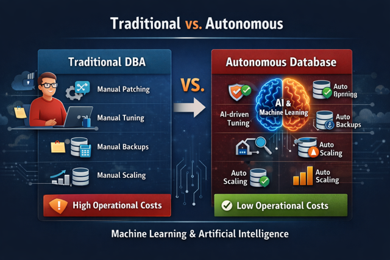

# ¿Tu base de datos se administra sola?
## Arquitectura moderna con Oracle Autonomous Database en Oracle Cloud Infrastructure

Durante décadas, administrar bases de datos ha sido una tarea compleja, costosa y altamente dependiente de intervención manual. Parches, backups, tuning, seguridad, alta disponibilidad y recuperación ante desastres siempre recayeron sobre DBAs y equipos de infraestructura.

Pero hoy la pregunta es legítima:

> **¿Y si la base de datos pudiera administrarse sola?**

Oracle Autonomous Database, dentro de **Oracle Cloud Infrastructure (OCI)**, nace precisamente para responder a esta necesidad, combinando automatización, resiliencia y rendimiento en una arquitectura cloud moderna.

---

## 🚀 ¿Qué es Oracle Autonomous Database?

Oracle Autonomous Database es un servicio de base de datos completamente administrado, diseñado para **automatizar tareas operativas críticas** mediante el uso intensivo de machine learning y capacidades nativas de OCI.

En la práctica, el servicio se encarga de:

- Provisionamiento
- Gestión de parches y upgrades
- Backups automáticos
- Seguridad avanzada
- Escalado dinámico
- Alta disponibilidad
- Optimización continua de rendimiento

Todo esto **sin intervención humana directa**.

---

## 🧱 Principios de la arquitectura autónoma

Oracle define Autonomous Database sobre cuatro pilares fundamentales:

### 🔁 Automatización
- Patching automático sin downtime
- Ajuste automático de índices y planes de ejecución
- Gestión inteligente de recursos

### ⚡ Rendimiento
- Basado en Oracle Exadata
- Escalado automático de CPU y almacenamiento
- Optimización continua basada en cargas reales

### 🔐 Seguridad
- Cifrado por defecto (en reposo y en tránsito)
- Parches de seguridad automáticos
- Reducción drástica del error humano

### ✅ Confiabilidad
- Alta disponibilidad integrada
- Backups automáticos
- Recuperación a un punto en el tiempo (PITR)

---

## ☁️ Arquitectura en OCI: cómo encaja Autonomous Database

Dentro de Oracle Cloud Infrastructure, Autonomous Database se apoya en una arquitectura diseñada para **resiliencia, aislamiento y escalabilidad**:

- Regiones y Availability Domains
- Separación entre plano de control y plano de datos
- Integración nativa con servicios de OCI como:
  - OCI IAM
  - OCI Networking
  - OCI Monitoring
  - OCI Object Storage
  - OCI Data Integration

Esto permite construir arquitecturas modernas **sin incrementar la complejidad operativa**.

## Arquitectura de Oracle Autonomous Database en OCI

---

## 🔄 Comparación con modelos tradicionales de bases de datos

### 🏗️ Modelo tradicional (On‑Premises o IaaS)

En un enfoque tradicional, incluso en la nube como IaaS, la responsabilidad sigue siendo del equipo técnico:

- El DBA gestiona parches y upgrades
- Backups y restores requieren planificación manual
- El tuning es reactivo y dependiente de experiencia humana
- La seguridad depende de configuraciones y revisiones periódicas
- El escalado requiere ventanas de mantenimiento
- Alto riesgo de error humano

Este modelo ofrece **control total**, pero a costa de:

- Mayor complejidad operativa  
- Más esfuerzo continuo  
- Costos operativos elevados  
- Escalabilidad limitada  

---

### 🤖 Oracle Autonomous Database

Con Autonomous Database, el modelo cambia radicalmente:

- Patching y upgrades automáticos, sin downtime
- Backups automáticos con PITR habilitado por defecto
- Optimización continua de rendimiento mediante ML
- Seguridad integrada y aplicada automáticamente
- Escalado dinámico de recursos
- Alta disponibilidad nativa

El equipo define políticas y arquitectura, pero **no administra la base a bajo nivel**.

---

## 📊 Resumen comparativo

| Aspecto | Modelo tradicional | Oracle Autonomous Database |
|------|-------------------|---------------------------|
| Gestión operativa | Manual | Automática |
| Patching | Programado por el DBA | Automático y continuo |
| Backups | Manual | Automáticos + PITR |
| Performance tuning | Reactivo | Proactivo y automático |
| Seguridad | Configuración manual | Integrada por defecto |
| Escalabilidad | Limitada | Dinámica |
| Riesgo de error humano | Alto | Mínimo |

---

## 🧠 Impacto para DBAs y arquitectos

Autonomous Database **no elimina el rol del DBA**, sino que lo transforma.

### Cambio de enfoque:
- ❌ Operación repetitiva
- ✅ Diseño de arquitectura
- ✅ Gobierno de datos
- ✅ Seguridad y cumplimiento
- ✅ Soporte a equipos de desarrollo y analytics

El DBA evoluciona hacia un rol **estratégico y arquitectónico**.

---

## 🎯 Casos de uso ideales

Autonomous Database encaja especialmente bien en:

- Plataformas analíticas (Autonomous Data Warehouse)
- Aplicaciones transaccionales modernas (ATP)
- Arquitecturas cloud‑first
- Entornos con alta exigencia de disponibilidad
- Equipos que buscan reducir errores humanos y costos operativos

---

## ❓ ¿Es la solución para todos?

No necesariamente.

El modelo tradicional sigue siendo válido cuando:
- Se requiere control extremo del SO
- Existen dependencias legacy específicas
- Hay restricciones regulatorias particulares

Autonomous Database es ideal cuando:
- Se prioriza agilidad y automatización
- Se necesita alta disponibilidad por defecto
- Se busca reducir overhead operacional
- Se adopta una estrategia cloud moderna

---

## ✅ Conclusión

Oracle Autonomous Database no solo moderniza la base de datos:  
**redefine cómo se administra una base de datos en la nube**.

Al automatizar tareas críticas, reducir el error humano y ofrecer seguridad y disponibilidad nativas, permite que DBAs y arquitectos se enfoquen en lo que realmente genera valor.

La pregunta ya no es si la base de datos *puede* administrarse sola, sino:

> **¿Qué podríamos lograr si ya no tuviéramos que administrarla como antes?**
``
---

## Autor

**Rafael Vida**  
Oracle ACE | DBA & Data Architect  
Oracle | MySQL |  AWS & OCI
